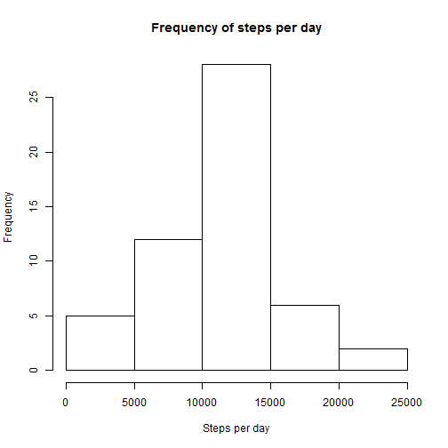
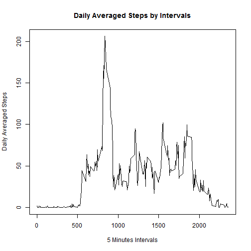
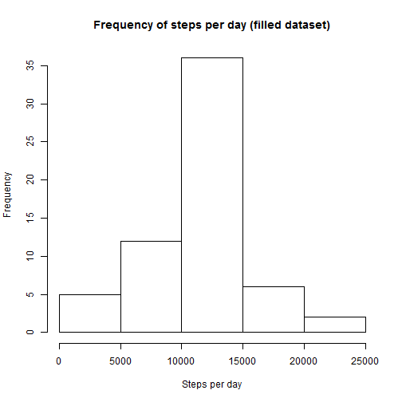

Reproducible Research - Peer Assessment 1
========================================================

## STEP1: Loading and preprocessing the data  
Load the data

```r
setwd("E:/Rdir/repdata1")
activity <- read.table(dir()[[1]],
                       sep=",",
                       header=TRUE,
                       stringsAsFactors=FALSE,
                       na.strings="NA")
```

Process/transform the data (if necessary) into a format suitable for your analysis

```r
activity$date <- as.Date(activity$date, "%Y-%m-%d")
```

## STEP2:What is mean total number of steps taken per day?  

Make a histogram of the total number of steps taken per day

```r
totalstepsperday <- aggregate(steps~date, data=activity, FUN=sum, na.rm=TRUE)
hist(totalstepsperday$steps, xlab="Steps per day", main="Frequency of steps per day")
```

 

Calculate and report the mean and median total number of steps taken per day

```r
mean(totalstepsperday$steps)
```

```
## [1] 10766
```

```r
median(totalstepsperday$steps)
```

```
## [1] 10765
```

## STEP3:What is the average daily activity pattern?  

Make a time series plot (i.e. type = "l") of the 5-minute interval (x-axis) and the average number of steps taken, averaged across all days (y-axis)

```r
stepsperInterval <- aggregate(steps~interval, FUN=mean ,data=activity, na.rm=TRUE)
plot(stepsperInterval$interval, 
     stepsperInterval$steps,
     type="l", 
     xlab="5 Minutes Intervals",
     ylab="Daily Averaged Steps",
     main="Daily Averaged Steps by Intervals")
```

 

```r
stepsperInterval[stepsperInterval$steps==max(stepsperInterval$steps),"interval"]
```

```
## [1] 835
```

Which 5-minute interval, on average across all the days in the dataset, contains the maximum number of steps?

```r
stepsperInterval[stepsperInterval$steps==max(stepsperInterval$steps),"interval"]
```

```
## [1] 835
```

## STEP4:Imputing missing values  

**Imputing Strategy:**I use the mean for that 5-minute interval to fill all the NA in the days.

Calculate and report the total number of missing values in the dataset (i.e. the total number of rows with NAs)

```r
paste("There're",length(activity$steps[is.na(activity$steps)]),"NAs")
```

```
## [1] "There're 2304 NAs"
```

Create a new dataset that is equal to the original dataset but with the missing data filled in.

```r
activity_filled <- activity
for(i in 1:nrow(activity_filled)){
        if(is.na(activity_filled$steps[i])){
                if(i%%nrow(stepsperInterval)==0){activity_filled$steps[i] <- stepsperInterval$steps[nrow(stepsperInterval)]} else
                        activity_filled$steps[i] <- stepsperInterval$steps[i%%nrow(stepsperInterval)]
                i <- i+1
        }
}
```
Make a histogram of the total number of steps taken each day.

```r
totalstepsperday_filled <- aggregate(steps~date, data=activity_filled, FUN=sum, na.rm=TRUE)
hist(totalstepsperday_filled$steps, xlab="Steps per day", 
     main="Frequency of steps per day (filled dataset)")
```

 
Find out the Mean and Median

```r
mean(totalstepsperday_filled$steps)
```

```
## [1] 10766
```

```r
median(totalstepsperday_filled$steps)
```

```
## [1] 10766
```

## STEP5: Are there differences in activity patterns between weekdays and weekends?

Create a new factor variable in the dataset with two levels ¨C ¡°weekday¡± and ¡°weekend¡± indicating whether a given date is a weekday or weekend day. 

```r
activity_filled$day=ifelse(as.POSIXlt(as.Date(activity_filled$date))$wday%%6==0,"weekend","weekday")
activity_filled$day=factor(activity_filled$day,levels=c("weekday","weekend"))
```
Make a panel plot containing a time series plot (i.e. type = "l") of the 5-minute interval (x-axis) and the average number of steps taken, averaged across all weekday days or weekend days (y-axis). The plot should look something like the following, which was creating using simulated data:

```r
stepsInterval2=aggregate(steps~interval+day,activity_filled,mean)

library(lattice)
xyplot(steps~interval|factor(day),data=stepsInterval2,aspect=1/2,type="l")
```

 
